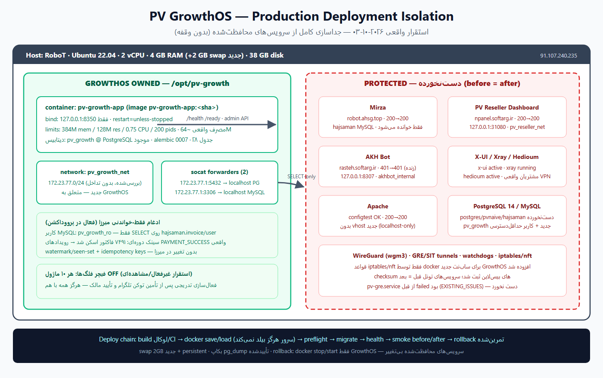
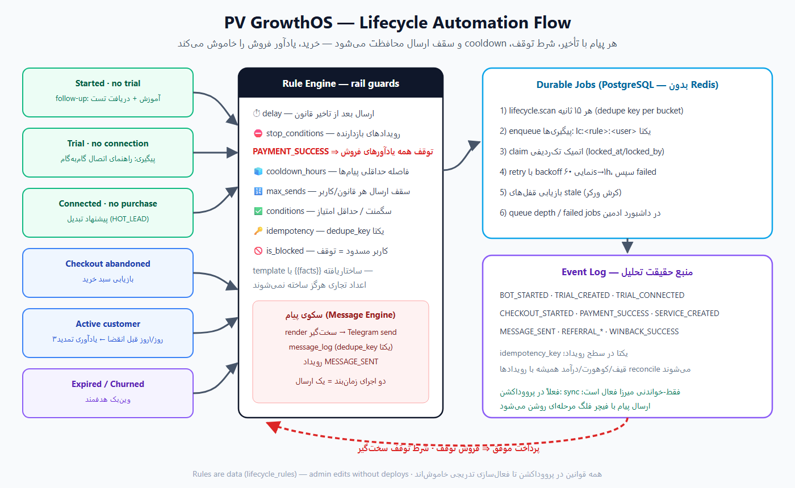
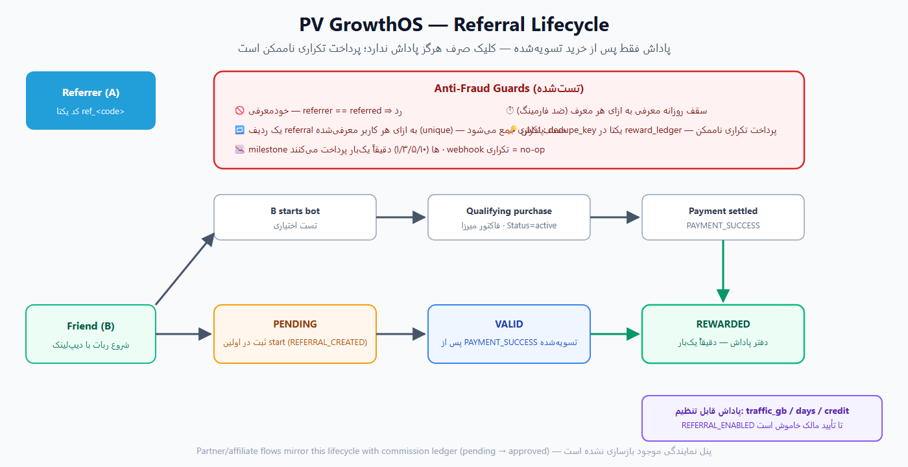

# پی‌وی گروث‌او‌اس (PV GrowthOS)

**سیستم‌عامل رشدِ خودکار و ایمن برای PV Network — طراحی‌شده، پیاده‌سازی‌شده و در حال اجرا روی سرور اصلی**

نسخه `1.0.0` · مونولیت ماژولار · FastAPI · SQLAlchemy 2 · PostgreSQL 14 · بومی تلگرام

[English README](README.md) · [ران‌بوک عملیات](docs/operations/RUNBOOK.md) · [گزارش کامل فارسی (PDF)](docs/report/PV-GrowthOS-Report-FA.pdf)

## پی‌وی گروث‌او‌اس چیست؟

گروث‌او‌اس **فروش و ارزش بلندمدت مشتری PV Network را با حداقل دخالت دستی رشد می‌دهد** — درست در کنار ربات فروش میرزا، پنل نمایندگی، ربات AKH و زیرساخت VPN که همه روی همان سرور زنده‌اند، **بدون کوچک‌ترین تغییری در آن‌ها**. میرزا منبع حقیقت باقی می‌ماند؛ گروث‌او‌اس مشاهده می‌کند، اتریبیوشن ثبت می‌کند، پیگیری‌ها را خودکار می‌کند و همه‌چیز را اندازه می‌گیرد.

## چطور فروش را خودکار می‌کند؟

مسیر کامل — هر قابلیت دقیقاً یکی از این مرحله‌ها را تقویت می‌کند:

جذب کاربر ← شروع ربات ← کانفیگ رایگان/تست ← اتصال ← مشاهده تعرفه ← پرداخت ← مشتری فعال ← تمدید ← معرفی دوستان ← افیلیت/نمایندگی ← بازگشت مشتری

| موتور | کاری که انجام می‌دهد |
|---|---|
| **اتریبیوشن** | منبع هر کاربر را از دیپ‌لینک `start=` می‌خواند؛ first-touch هرگز بازنویسی نمی‌شود |
| **کانفیگ رایگان** | دو استخر مستقل: عمومی (منابع تأییدشده + فیلتر مرحله‌ای) و اختصاصی PV (سهمیه/اعتبار/لوکیشن قابل تنظیم با اورراید تاریخ) |
| **چرخه حیات** | قوانین داده‌محور با تأخیر، شرط توقف، cooldown و سقف ارسال — **خرید، همه یادآورهای فروش را خاموش می‌کند** |
| **معرفی** | پاداش فقط پس از خریدِ تسویه‌شده؛ ضد خود‌معرفی، سقف روزانه، دفتر پاداش با dedupe ابدی |
| **تحلیل** | قیف، کوهورت، درآمد به تفکیک منبع — هر عدد با رویدادهای خام reconcile می‌شود |
| **اینستاگرام** | انتشار از API پشتیبانی‌شده Meta + اتریبیوشن دقیق هر محتوا با `socialc_<content_id>`؛ بهینه‌سازی با trial/خرید، نه صرفاً reach |
| **ادمین** | مدیریت کمپین/قالب/قانون/منبع/فلگ + داشبورد سلامت و صف کارها |

## چطور بدون آسیب به میرزا کنار آن اجرا می‌شود؟

- گروث‌او‌اس فقط مالک `/opt/pv-growth`، کانتینر خودش، شبکه اختصاصی `pv_growth_net`، نقش دیتابیسی خودش و دو فوروادر socat است — هیچ‌چیز دیگری
- **اتصال به میرزا فقط-خواندنی است**: کاربر MySQL با دسترسی صرفاً `SELECT` روی دو جدول `invoice` و `user`؛ هیچ تغییری در فایل‌ها، کد یا دیتابیس میرزا نمی‌دهیم
- زنجیره استقرار: بیلد بیرون از سرور ← انتقال ایمیج ← preflight ← مایگریشن ← سلامت ← دوده قبل/بعد ← در صورت کوچک‌ترین رگرسیون، رول‌بک فقط خود گروث‌او‌اس
- همه‌ی نوشتن‌ها با کلید idempotency یکتا — اجرای دوباره زمان‌بند عملاً هیچ اثری ندارد

## وضعیت عملیاتی و کاندید انتشار (۲۰۲۶-۱۰-۰۶)

| مورد | وضعیت |
|---|---|
| مبنای پروداکشن | کانتینر `pv-growth-app` روی `RoboT` در آخرین مبنای ثبت‌شده ۲۰۲۶-۱۰-۰۵ سالم بوده؛ کاندید hardening جدید را قبل از CI/rollout، مستقرشده اعلام نمی‌کنیم |
| دسترسی | فقط `127.0.0.1:8350` (هرگز 0.0.0.0) |
| منابع | سقف ۳۸۴ مگابایت RAM / ۰٫۷۵ CPU / ۲۰۰ pid |
| دیتابیس | مبنای پروداکشن روی Alembic `0007`؛ کاندید جدید head=`0011` با زنجیره downgrade تست‌شده |
| سینک میرزا | مسیر موجود فقط‌خواندنی با `pv_growth_ro`؛ در کاندید جدید پرداخت فقط بر اساس transition واقعی ثبت می‌شود و اسکن تکراری conversion جعلی نمی‌سازد |
| تلگرام | **فعال** — ربات [@pvgrowthos_bot](https://t.me/pvgrowthos_bot) و کانال [PV Network | Free Config](https://t.me/pvnetwork_freeconfig) · اتریبیوشن دیپ‌لینک سرتاسری تأیید شده |
| حلقه فروش هسته | کانفیگ رایگان/اختصاصی، lifecycle، referral و attribution مسیرهای موجودند؛ کاندید سهمیه همزمان، retry پایدار، delivery صادقانه و conversion coordinator اضافه می‌کند |
| فلگ‌ها | ۱۱ فلگ تعریف شده؛ رفتارهای خطرناک پیش‌فرض خاموش‌اند و DB override کلید توقف است. در rollout فقط فلگ‌هایی برمی‌گردند که قبلش واقعاً روشن بوده‌اند |
| سرویس‌های محافظت‌شده | میرزا ۲۰۰→۲۰۰ · پنل ۲۰۰→۲۰۰ · AKH ۴۰۱→۴۰۱ · تونل‌ها/فایروال: بدون تغییر (مستند در `docs/deployment-audits/`) |
| تست کاندید | format/lint/DoD/security scan و round-trip محلی SQLite سبز؛ suite کامل SQLite+PostgreSQL و Docker artifact گیت اجباری GitHub CI است |
| بکاپ/رول‌بک | بکاپ pg_dump تأییدشده · تمرین رول‌بک زنده انجام شد |
| پروویژن اختصاصی | فقط namespace `growth-*`؛ در کاندید TLS verification پیش‌فرض روشن، قفل سهمیه DB و retry کنترل‌شده اضافه شده |
| اینستاگرام | کد آماده‌ی کاندید است اما اتوماسیون زنده تا آماده‌شدن مجوز Meta Professional و public media origin خاموش می‌ماند |

## کانال کانفیگ رایگان

استخر عمومی فقط از منابع تأییدشده‌ی ادمین تغذیه می‌شود: دریافت ← تجزیه ← اعتبارسنجی ← حذف تکراری ← امتیاز ← بررسی سلامت محدود (فقط چند اتصال TCP، هرگز تست انبوه از سرور VPN) ← انتشار ۱–۲ مورد برتر با برچسب «منبع عمومی». استخر اختصاصی PV با سهمیه، اعتبار، لوکیشن و سقف claim قابل تنظیم — حتی اورراید روزانه بدون تغییر کد.

## چرخه حیات و معرفی

در قالب پیام، متغیرها فقط از داده ساختاریافته پر می‌شوند — اگر عددی در داده نباشد، پیام **اصلاً ارسال نمی‌شود**؛ هیچ قیمت/حجم/آپ‌تایم جعلی ساخته نمی‌شود. پاداش معرفی فقط پس از پرداخت تسویه‌شده پرداخت می‌شود و دقیقاً یک‌بار.

## اینستاگرام برای فروش، نه عدد نمایشی

هر محتوای برنامه‌ریزی‌شده CTA پایدار `socialc_<content_id>` دارد؛ وقتی کاربر
از همان محتوا وارد ربات شود، منبع دقیق `socialc:<content_id>` همراه کمپین ثبت
می‌شود. بنابراین optimizer می‌تواند reach/engagement را به trial و خرید همان
محتوا وصل کند. اگر نتیجه انتشار post/reel مبهم باشد فقط با marker یکتای owned
media در پنجره زمانی محدود reconcile می‌شود و هرگز کورکورانه دوباره publish
نمی‌شود؛ story مبهم fail-closed می‌ماند. رفتن به Explore دست Meta است و تضمین
۱۰۰٪ ندارد؛ چیزی که سیستم خودکار می‌کند انتشار رسمی، اندازه‌گیری، attribution و
بهینه‌سازی بر اساس فروش است.

## امنیت

- هیچ secret در گیت؛ فایل canonical `/opt/pv-growth/config/.env` روی سرور root-only با مجوز 600
- ادمین با توکن (مقایسه constant-time)؛ rate-limit روی ingestion و webhook
- نقش‌های حداقل‌دسترسی دیتابیس؛ `pv_growth_ro` فقط SELECT روی دو جدول مشخص میرزا
- dependencyهای پروداکشن hash-lock شده‌اند و CI روی lock واقعی `pip-audit` اجرا می‌کند
- دستورهای تخریبی (`docker system prune`, `iptables -F`, …) در `SECURITY.md` ممنوع و مکتوب

## معماری و دیاگرام‌ها

هفت دیاگرام در [`docs/images/`](docs/images): قیف رشد، معماری، فازها، خط تولید کانفیگ، جریان چرخه حیات، چرخه معرفی و جداسازی استقرار. معماری کامل: [`ARCHITECTURE.md`](ARCHITECTURE.md)

## استقرار و عملیات

ران‌بوک کامل: [`DEPLOYMENT.md`](DEPLOYMENT.md) · [`docs/operations/RUNBOOK.md`](docs/operations/RUNBOOK.md) — شامل سلامت روزانه، توقف فوری اتوماسیون، مدیریت کارهای شکست‌خورده، رفتار با خطای تلگرام/دیتابیس/دیسک و رول‌بک (فقط گروث‌او‌اس، هرگز سرویس‌های محافظت‌شده).

## تست‌ها

تست‌ها idempotency، ایمنی scheduler، تقلب referral، رد ساخت واقعیت تجاری، webhook، transition میرزا، quota/retry پروویژن، وضعیت delivery، attribution تک‌محتوا و reconciliation اینستاگرام را پوشش می‌دهند. CI کل suite و مایگریشن را روی SQLite و PostgreSQL اجرا می‌کند، lock dependency را audit می‌کند و فقط بعد از سبزشدن، ایمیج دقیق همان SHA را artifact می‌کند.

