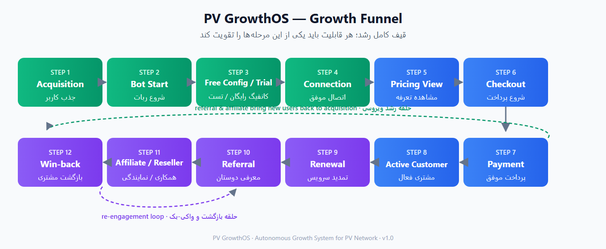
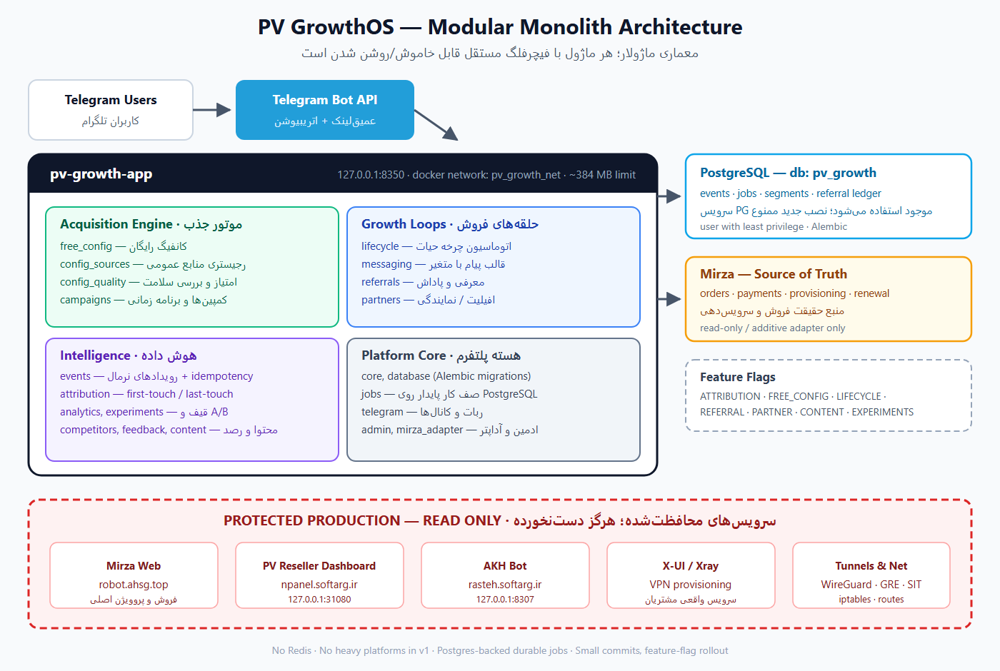
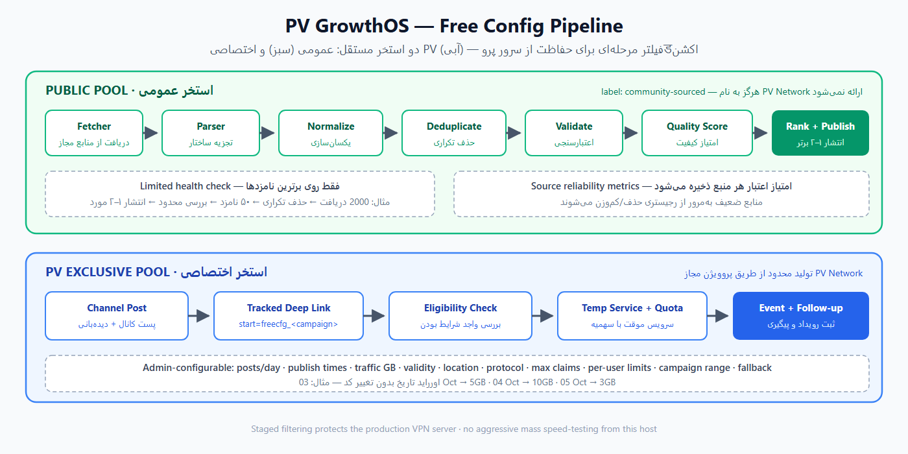
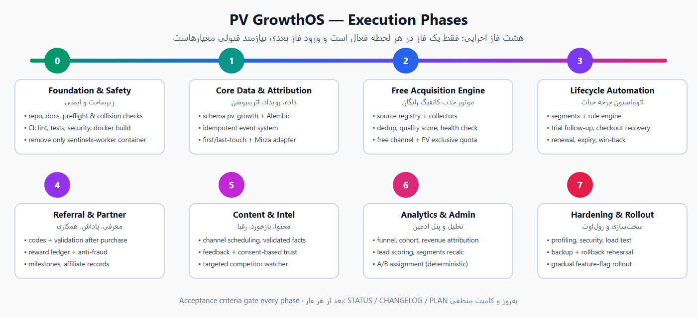

<div align="center">

# PV GrowthOS

**Autonomous, production-safe growth operating system for PV Network**

سیستم عامل رشدِ خودکار و ایمن برای نمایشگاه PV Network

`v1.0 · IMPLEMENTED · Modular Monolith · FastAPI + SQLAlchemy 2 + PostgreSQL · Telegram-native`

> **Status:** Phases 0–7 implemented · 73 tests passing · 7 migrations ·
> Definition-of-Done audit: 42 PASS / 0 FAIL / 4 BLOCKED (external-only — see `BLOCKERS.md`)

[English](#-english) | [فارسی](#-فارسی)

</div>

---

## 🇬🇧 English

### What is PV GrowthOS?

PV GrowthOS is a growth automation system designed to run **on a live production VPN server** alongside existing services (Mirza sales bot, PV Reseller Dashboard, AKH Bot, X-UI/Xray, WireGuard/GRE/SIT tunnels) **without touching them**.

It has exactly one business objective:

> **Increase PV Network sales and long-term customer value with as little manual operation as possible.**

Every feature must strengthen at least one stage of the funnel below — acquisition, trial-to-paid conversion, renewal, win-back, referrals, or reseller/affiliate distribution.

### Growth Funnel



The complete target funnel:

```
Acquisition → Bot Start → Free Config / Trial → Connection → Pricing View
→ Checkout → Payment → Active Customer → Renewal → Referral
→ Affiliate / Reseller → Win-back
```

### Architecture



A **modular monolith** (`pv-growth-app`) — not microservices. Bounded to `127.0.0.1:8350`, its own Docker network (`pv_growth_net`), its own database (`pv_growth` on the existing PostgreSQL server), and hard resource limits (~384 MB RAM, 0.5–0.75 CPU).

Key design decisions:

| Decision | Choice | Why |
|---|---|---|
| Runtime shape | Modular monolith | 2 vCPU / 4 GB host; microservices would waste resources |
| Job system | PostgreSQL-backed durable jobs | No Redis in v1; idempotency keys prevent duplicate sends |
| Analytics | Lightweight SQL funnels/cohorts | No PostHog/Grafana on a production VPN server |
| Mirza integration | Read-only / additive adapter | Mirza stays the source of truth for payments & provisioning |
| Rollout | Per-module feature flags | Every automation is independently switchable; dangerous ones ship disabled |

### Free Config Acquisition



Two independent pools:

- **Public pool** — configs collected from an admin-approved registry of public GitHub/Telegram sources, passed through staged filtering (fetch → parse → normalize → dedupe → validate → quality score → limited health check → publish top 1–2). Always labeled community-sourced; never implied to be operated by PV Network.
- **PV exclusive pool** — limited free configs generated through authorized PV provisioning, with admin-configurable quota, validity, location, protocol, claim limits and per-date overrides — no code changes required.

### Execution Phases



Eight strictly-ordered phases, each gated by acceptance criteria: Foundation & Safety → Core Data/Events/Attribution → Free Acquisition → Lifecycle Automation → Referral/Partner → Content/Feedback/Competitor Intel → Analytics/Admin/Experiments → Hardening & Gradual Rollout.

### Safety Model

- **Protected resources are read-only**: Mirza, PV Reseller Dashboard, AKH Bot, X-UI/Xray, tunnels, iptables/nftables, existing Docker networks.
- **Namespace isolation**: GrowthOS owns only `/opt/pv-growth`, its containers, its DB user, its network.
- **No heavy builds on production**: CI (GitHub Actions) builds/tests/publishes images; production only pulls.
- **Smoke tests before & after every deploy**: if any protected service fails after a GrowthOS action → immediate GrowthOS rollback, no random fixes to the protected service.
- **Forbidden by spec**: `docker system prune`, `iptables -F`, `nft flush ruleset`, broad `rm -rf`, network deletion/recreation.
- **No secrets in Git**; least-privilege DB user; admin auth required; no fake scarcity/uptime/user counts in messages.

### Quickstart

```bash
pip install -r requirements-dev.txt
export PVG_DATABASE_URL="sqlite+pysqlite:///./dev.db"   # prod: PostgreSQL 14
python -m pv_growth migrate        # alembic upgrade head (7 revisions)
python -m pv_growth serve          # FastAPI on 127.0.0.1:8350
python -m pytest                   # 73 tests
python scripts/dod_audit.py        # machine-verifiable Definition-of-Done audit
```

Production runbook (preflight → migrate → deploy → smoke → rollback): `DEPLOYMENT.md`.

### Repository Layout (implemented)

```
PV-GrowthOS/
├── src/pv_growth/
│   ├── main.py · cli.py · preflight.py · smoke.py
│   ├── core/          # settings · JSON logging · feature flags · errors
│   ├── database/      # engine/sessions · models registry (all domains)
│   ├── api/           # health · events ingestion · admin API · telegram webhook
│   ├── events · attribution · mirza_adapter · telegram
│   ├── jobs/          # PostgreSQL durable queue · runner · scheduler thread
│   ├── config_sources · config_quality · free_config   # staged public pipeline + PV exclusive
│   ├── campaigns · lifecycle · messaging · segments
│   ├── referrals · partners                           # rewards/commissions with anti-fraud
│   ├── content · competitors · feedback
│   └── analytics · experiments · admin                # funnels/cohorts · deterministic A/B
├── alembic/versions/  # 0001..0007, tested up+down in CI (SQLite + PostgreSQL matrix)
├── tests/             # 73 tests: idempotency · scheduler-duplicate · fraud · facts · webhook
├── scripts/           # preflight/smoke CLI companions · backup · load probe · DoD audit · sentinelx
├── .github/workflows/ci.yml   # ruff · pytest matrix · migration up/down · pip-audit · docker build
└── docs/              # diagrams + full Persian PDF report
```

### Full Persian Report

A complete Persian-language PDF report covering objectives, architecture, safety model, engines, phases and definition-of-done is available at:

`docs/report/PV-GrowthOS-Report-FA.pdf`

### Completion audit

`python scripts/dod_audit.py` verifies every Master-Spec component programmatically
(modules contain code, routes exist, migrations chain, flags defined, no stubs,
tests+lint green). Current result: **42 PASS · 0 FAIL · 4 BLOCKED** — blocked items
are server/credential-only dependencies documented in `BLOCKERS.md`.

---

## 🇮🇷 فارسی

<div dir="rtl">

### پی‌وی گروث‌او‌اس چیست؟

**گروث‌او‌اس** یک سیستم خودکارسازی رشد است که طراحی شده تا **روی سرور پرووداکشنِ زنده‌ی VPN** و در کنار سرویس‌های موجود (ربات فروش میرزا، پنل نمایندگی PV، ربات AKH، X-UI/Xray و تونل‌های WireGuard/GRE/SIT) اجرا شود، **بدون کوچک‌ترین دخالتی در آن‌ها**.

این سیستم فقط یک هدف تجاری دارد:

> **افزایش فروش و ارزش بلندمدت مشتریان PV Network با کمترین میزان عملیات دستی.**

هر قابلیت باید حداقل یکی از مراحل قیف زیر را تقویت کند: جذب کاربر، تبدیل تست‌به‌پرداخت، تمدید، بازگرداندن مشتری، معرفی دوستان یا توسعه کانال نمایندگی.

### قیف رشد


قیف کامل هدف:

```
جذب کاربر → شروع ربات → کانفیگ رایگان/تست → اتصال → مشاهده تعرفه
→ پرداخت → مشتری فعال → تمدید → معرفی دوستان → افیلیت/نمایندگی → بازگشت مشتری
```

### معماری


یک **مونولیت ماژولار** (`pv-growth-app`) — نه میکروسرویس. متصل به `127.0.0.1:8350`، با شبکه داکر اختصاصی (`pv_growth_net`)، دیتابیس اختصاصی (`pv_growth` روی سرور PostgreSQL موجود) و محدودیت سخت‌گیرانه منابع (حدود ۳۸۴ مگابایت رم، ۰٫۵ تا ۰٫۷۵ هسته CPU).

مهم‌ترین تصمیم‌های طراحی:

| تصمیم | انتخاب | دلیل |
|---|---|---|
| شکل اجرا | مونولیت ماژولار | سرور ۲ هسته/۴ گیگ؛ میکروسرویس هدر دادن منابع است |
| سیستم کار | صف پایدار روی PostgreSQL | در نسخه اول بدون Redis؛ کلید idempotency جلوی ارسال تکراری را می‌گیرد |
| تحلیل داده | قیف و کوهورت سبک با SQL | نصب PostHog/Grafana روی سرور VPN تولیدی ممنوع |
| اتصال به میرزا | آداپتر فقط-خواندنی / افزایشی | میرزا منبع حقیقت پرداخت و پروویژن باقی می‌ماند |
| رول‌اوت | فیچر‌فلگ برای هر ماژول | هر اتوماسیون مستقلاً قابل خاموش/روشن است؛ موارد پرریسک غیرفعال شروع می‌کنند |

### موتور جذب کانفیگ رایگان


دو استخر مستقل:

- **استخر عمومی** — کانفیگ‌هایی از رجیستریِ تأییدشده‌ی منابع عمومی گیت‌هاب/تلگرام که با فیلتر مرحله‌ای عبور می‌کنند: دریافت ← تجزیه ← یکسان‌سازی ← حذف تکراری ← اعتبارسنجی ← امتیاز کیفیت ← بررسی محدود سلامت ← انتشار ۱ تا ۲ مورد برتر. همیشه با برچسب «منبع عمومی/کامانیوتی»؛ هرگز القا نمی‌شود که PV Network آن‌ها را اداره می‌کند.
- **استخر اختصاصی PV** — کانفیگ‌های رایگانِ محدود که از پروویژن مجاز PV ساخته می‌شوند؛ با سهمیه، اعتبار، لوکیشن، پروتکل، سقف claim و اورراید تاریخِ قابل تنظیم توسط ادمین — بدون نیاز به تغییر کد.

### فازهای اجرا


هشت فاز با ترتیب اکید که هر کدام فقط با قبولی معیارهای پذیرش بسته می‌شوند: زیرساخت و ایمنی ← داده/رویداد/اتریبیوشن ← موتور جذب رایگان ← اتوماسیون چرخه حیات ← معرفی/همکاری ← محتوا/بازخورد/رصد رقبا ← تحلیل/ادمین/آزمایش ← سخت‌سازی و رول‌اوت تدریجی.

### مدل ایمنی

- **منابع محافظت‌شده فقط-خواندنی‌اند**: میرزا، پنل نمایندگی، ربات AKH، X-UI/Xray، تونل‌ها، iptables/nftables و شبکه‌های داکر موجود.
- **جداسازی فضای نام**: گروث‌او‌اس فقط مالک `/opt/pv-growth`، کانتینرهای خودش، کاربر دیتابیس و شبکه خودش است.
- **بدون بیلد سنگین روی پرووداکشن**: CI (گیت‌هاب اکشنز) ایمیج را می‌سازد/تست می‌کند/منتشر می‌کند؛ سرور فقط pool می‌کند.
- **تست دودی قبل و بعد هر استقرار**: اگر پس از یک عملیات گروث‌او‌اس هر سرویس محافظت‌شده‌ای از کار بیفتد ← بازگشت فوری گروث‌او‌اس، بدون دستکاری سرویس محافظت‌شده.
- **ممنوع طبق مشخصات**: `docker system prune`، `iptables -F`، `nft flush ruleset`، حذف broad با `rm -rf` و حذف/ساخت مجدد شبکه‌ها.
- **هیچ secret در گیت نیست**؛ کاربر دیتابیس با حداقل دسترسی؛ ادمین نیاز به احراز هویت دارد؛ در پیام‌ها هیچ کمیابی/آپ‌تایم/تعداد کاربر جعلی ساخته نمی‌شود.

### اجرا و وضعیت پیاده‌سازی

```bash
pip install -r requirements-dev.txt
export PVG_DATABASE_URL="sqlite+pysqlite:///./dev.db"   # در پرووداکشن: PostgreSQL 14
python -m pv_growth migrate      # ۷ مایگریشن
python -m pv_growth serve        # اجرا روی 127.0.0.1:8350
python -m pytest                 # ۷۳ تست
python scripts/dod_audit.py      # ممیزی ماشین‌خوان definition-of-done
```

وضعیت: هر ۸ فاز پیاده‌سازی شده · ۷۳ تست پاس · ممیزی پایان کار: ۴۲ PASS، ۰ FAIL، ۴ BLOCKED (فقط وابستگی‌های خارجی — رجوع به `BLOCKERS.md`). ساختار کامل سورس در `src/pv_growth/` شامل همه ماژول‌های الزامی مشخصات است؛ ران‌بوک استقرار در `DEPLOYMENT.md`.

### گزارش کامل فارسی

نسخه کامل گزارش فارسی (PDF) شامل هدف‌ها، معماری، مدل ایمنی، موتورها، فازها و معیار پایان کار:

`docs/report/PV-GrowthOS-Report-FA.pdf`

</div>

---

<div align="center">

**Spec**: `MASTER_SPEC.md` · **Report (FA)**: `docs/report/PV-GrowthOS-Report-FA.pdf`

</div>
